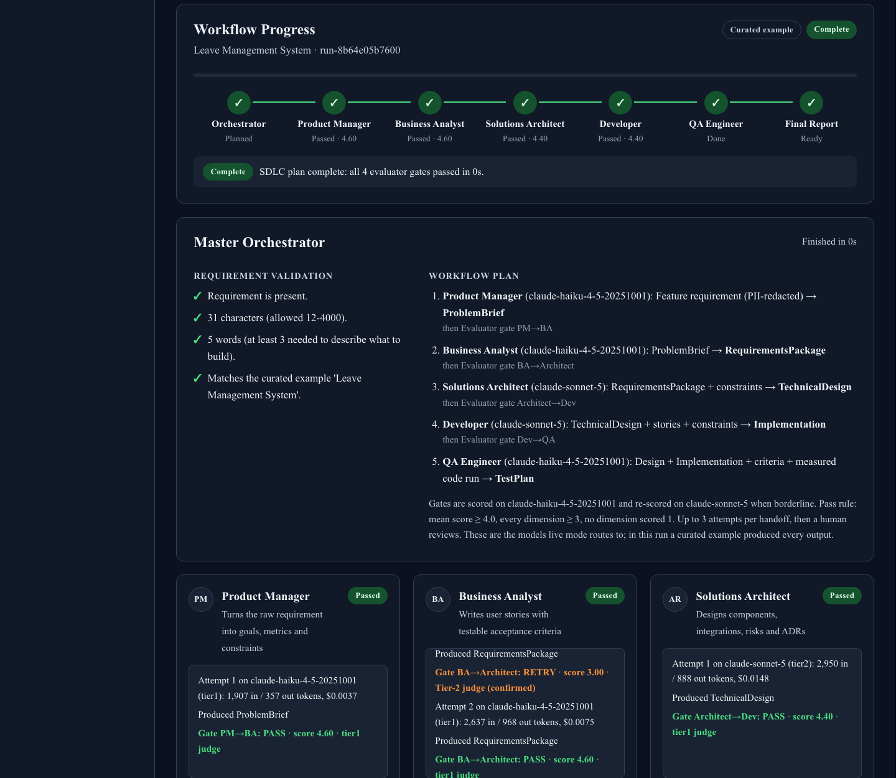
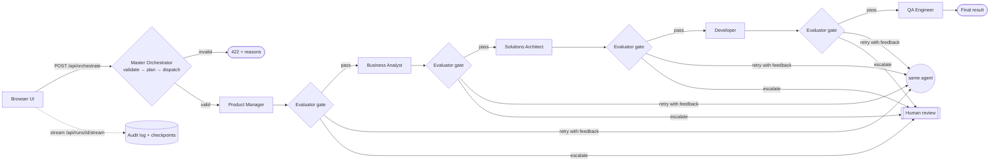
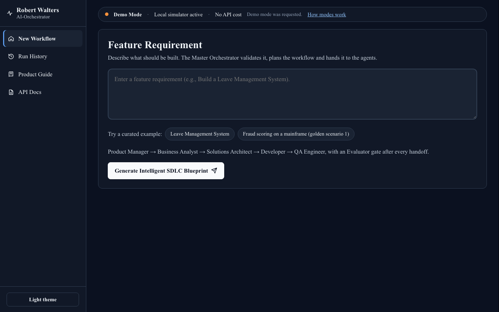
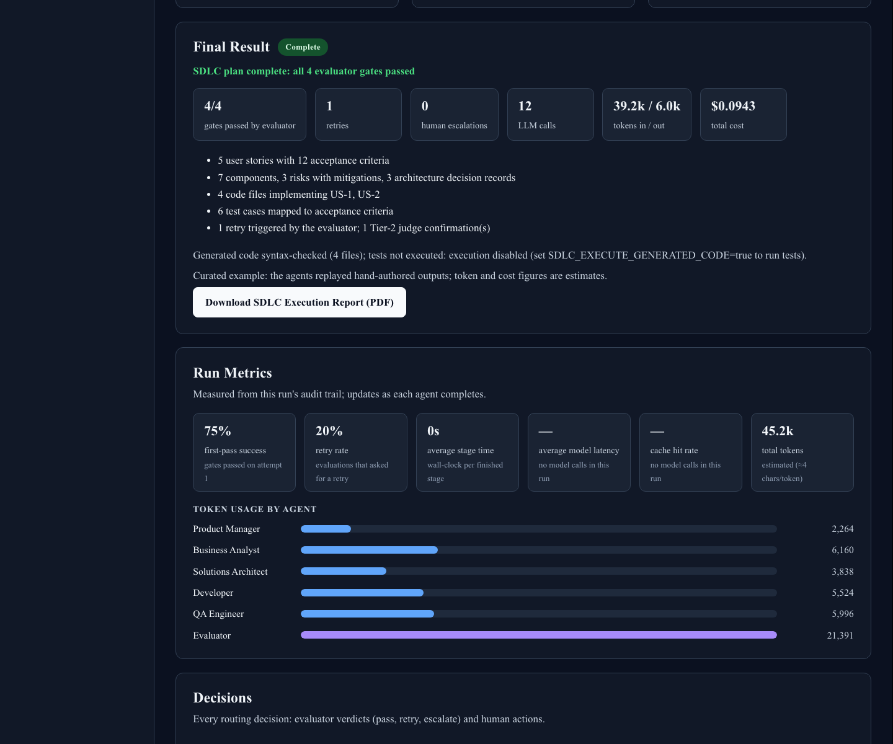
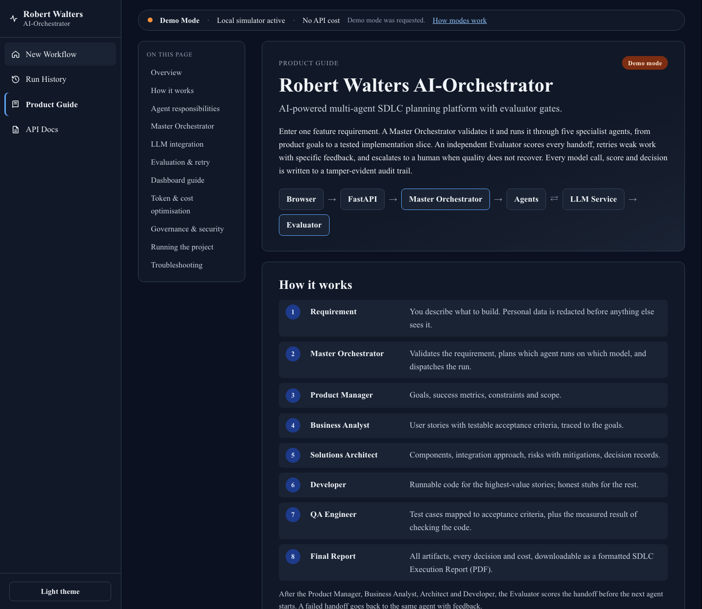

# Robert Walters AI-Orchestrator

**A multi-agent SDLC pipeline with an independent evaluator agent.**

You enter a feature requirement in the browser, for example "Build a Leave Management System". A **Master Orchestrator** validates it, plans the workflow and dispatches it to five agents:

**Product Manager → Business Analyst → Solutions Architect → Developer → QA Engineer**

An **Evaluator** scores every handoff on a five-dimension rubric. A low-quality handoff is **retried** with specific feedback, moved up to a stronger model on its last attempt, and finally **escalated to a human**, who can accept it, redirect it or abort the run. Every model call, score, retry and decision goes into a tamper-evident audit log, and that log is the dataset behind every metric in the docs.

**Purpose.** It asks for a five-persona SDLC loop with a separate evaluator whose reliability is *measurable*, not merely orchestration that looks like it works. Here every gate decision is computed in code from rubric scores, every retry and escalation is recorded, and the evaluation harness turns that record into pass rates, retry rates, latency, tokens and cost.

The browser shows each agent working in real time, and an in-app **Product Guide** explains the whole system.



## Contents

1. [Quick start](#quick-start)
2. [Architecture](#architecture)
3. [Product Guide and screenshots](#product-guide-and-screenshots)
4. [Folder structure](#folder-structure)
5. [Prerequisites](#prerequisites)
6. [Installation](#installation)
7. [Environment variables](#environment-variables)
8. [Running the project](#running-the-project)
9. [Entry points](#entry-points)
10. [Live mode and demo mode](#live-mode-and-demo-mode)
11. [Development vs production](#development-vs-production)
12. [Docker](#docker)
13. [Browser URLs](#browser-urls)
14. [API documentation](#api-documentation)
15. [Evaluation flow](#evaluation-flow)
16. [Token and cost optimisation](#token-and-cost-optimisation)
17. [Security considerations](#security-considerations)
18. [Troubleshooting](#troubleshooting)
19. [Further documentation](#further-documentation)

## Quick start

```bash
uv sync                  # install (Python 3.13)
make start               # http://127.0.0.1:8000: live if ANTHROPIC_API_KEY works, else demo mode
```

Open **http://127.0.0.1:8000**, type a requirement and click **Generate Intelligent SDLC Blueprint**. No API key is needed to try it: without one the app runs in demo mode (see [Live mode and demo mode](#live-mode-and-demo-mode)).

## Architecture

```
Browser ──HTTP / Server-Sent Events──▶ FastAPI ──▶ Master Orchestrator ──▶ LangGraph pipeline
                                                                             │
                              Agents (PM · BA · Architect · Developer · QA) ◀┤
                                         │                                   │
                                         ▼                                   │
                              LLM Service ──▶ Claude API (live) │ Simulator (demo)
                                                                             │
                              Evaluator gate after every handoff ◀───────────┘
                              (pass · retry · escalate to a human)
                                         │
                                         ▼
                              Audit log + checkpoints ──▶ run view ──▶ Browser
```

The same flow with every decision point:



The pieces, from the outside in:

- **Browser UI** (`src/sdlc_loop/web/static`): plain HTML, CSS and JavaScript served by FastAPI from the same origin, with no build step. It follows each run over Server-Sent Events, so every agent start, verdict and retry appears as it happens, with polling as a fallback.
- **LLM Service** (`src/sdlc_loop/llm`): one interface shared by every agent and the evaluator. Live mode plugs in the Claude API; demo mode plugs in curated examples or the local simulator.
- **Master Orchestrator** (`src/sdlc_loop/orchestrator/master.py`):
  - Redacts personal data from the requirement.
  - Validates it: free rule checks first, then either a demo-mode match or a cheap LLM triage in live mode.
  - Plans which agent runs on which model.
  - Hands the run to the pipeline.
- **Pipeline** (`src/sdlc_loop/graph`): a LangGraph state machine. Each agent is a node, and each evaluator gate is a node followed by conditional edges (PASS / RETRY / ESCALATE). Human review pauses the graph with `interrupt()`. A SQLite checkpointer saves state after every step, so a paused run survives a restart.
- **Evaluator** (`src/sdlc_loop/agents/evaluator.py`). Checks run cheapest first:
  1. A deterministic pre-gate that costs 0 tokens.
  2. A Haiku judge.
  3. A Sonnet re-score, only when the Haiku result is borderline or about to page a human.

  **Code, not a model, computes the verdict:** PASS needs a mean score ≥ 4.0, every dimension ≥ 3, and no dimension scored 1.
- **Audit log** (`src/sdlc_loop/governance/audit.py`): append-only and hash-chained. The browser view, the metrics and the cost reports are all computed from it.

Diagrams with data flow and every decision point: [docs/architecture.md](docs/architecture.md). How the UI, the orchestrator and the agents talk to each other: [docs/ui-and-orchestrator.md](docs/ui-and-orchestrator.md).

## Product Guide and screenshots

The sidebar's **Product Guide** is documentation built into the app:

- how the workflow runs;
- what each agent receives, produces and is judged on;
- what the Master Orchestrator does (and that it is not an LLM);
- how live and demo mode work;
- the rubric and retry ladder, with a worked example;
- an annotated dashboard tour, cost levers, governance, run commands and troubleshooting.

Open it at http://127.0.0.1:8000/?view=guide.

| | |
|---|---|
|  |  |
| **Feature Requirement** with the compact mode status bar | **Live progress**: stepper, orchestrator plan and agent cards |
|  |  |
| **Final Result and Run Metrics**: first-pass rate, retry rate, token usage per agent | **Product Guide** |

### SDLC Execution Report (PDF)

When a run finishes, **Download SDLC Execution Report (PDF)** in the Final Result section produces a print-ready report of the whole run, built from the same audit log as the dashboard:

1. cover page with run facts, the outcome headline and headline metrics;
2. executive summary, requirement and the orchestrator's validation checks;
3. workflow plan (agents, models, inputs and outputs, gates);
4. evaluator scorecard (five rubric scores per attempt, low scores shaded) and every governance decision;
5. each agent's deliverable (goals, user stories with acceptance criteria, architecture and ADRs, source code, test cases), with retry history and evaluator feedback;
6. cost and performance per agent, and the full execution timeline.

The same file is available from the API at `GET /api/runs/{id}/report.pdf`. It uses Times New Roman when that font is installed and the built-in PDF Times font otherwise, so it also works in Docker.

Status colours are consistent everywhere: blue running, gray waiting, orange retry, red needs review or failed, green passed or complete, purple accepted by a human. Dark theme is the default; the **Light theme / Dark theme** button in the sidebar switches it.

## Folder structure

```
├── src/sdlc_loop/
│   ├── api/            app.py (FastAPI routes), main.py (ASGI entry point), auth.py (roles)
│   ├── web/static/     index.html, app.css, app.js: the browser UI and Product Guide (guide/ holds its screenshot)
│   ├── orchestrator/   master.py (Master Orchestrator), view.py (what the browser renders)
│   ├── reports/        pdf.py (SDLC Execution Report), fonts.py
│   ├── graph/          LangGraph state machine: stages, nodes, routing rules, checkpointing
│   ├── agents/         one module per agent + the evaluator
│   ├── prompts/        agent prompts as .md files (reviewable in diffs)
│   ├── llm/            Anthropic client, Batch API client, model router, cache layout, costs
│   ├── demo/           demo mode: curated examples + the local simulator
│   ├── quality/        deterministic pre-gate checks
│   ├── tools/          code verifier (syntax check + optional sandboxed test run)
│   ├── governance/     audit log, PII redaction
│   ├── services/       composition root (container.py) + RunService
│   ├── schemas/        Pydantic contracts for every artifact and decision
│   ├── runtime.py      live/demo mode selection at startup
│   ├── config.py       all settings (environment variables)
│   └── cli.py          the `sdlc` command
├── evals/              evaluation harness: golden runs, judge benchmark, human agreement
├── scenarios/          golden scenarios (spec §7) + PII / prompt-injection probes
├── tests/              unit/ and integration/ (offline, deterministic)
├── docs/               architecture, AI stack, evaluation, cost, governance, UI & orchestrator
├── Dockerfile, docker-compose.yml
└── Makefile            every command below
```

## Prerequisites

- **Python 3.13.** `uv` installs it automatically if it is missing.
- **[uv](https://docs.astral.sh/uv/)** 0.5 or later, the package manager. Install with `curl -LsSf https://astral.sh/uv/install.sh | sh`.
- **Optional: an Anthropic API key** for live mode.
- **Optional: Docker** for the container setup.

## Installation

```bash
git clone <repo-url> robert-walters-ai-orchestrator && cd robert-walters-ai-orchestrator
uv sync                          # creates .venv from uv.lock (reproducible)
cp .env.example .env             # then add ANTHROPIC_API_KEY for live mode (optional)
make test                        # 122 offline tests, about 3 s
```

## Environment variables

Settings are read from the environment or from `.env`. The full list with comments is in [.env.example](.env.example).

| Variable | Default | Purpose |
|---|---|---|
| `ANTHROPIC_API_KEY` | — | Enables live mode. Read only by the Anthropic SDK. |
| `SDLC_MODE` | `auto` | `auto`: live if the key is found **and verified**, otherwise demo. `live`: fail at startup without a working key. `demo`: never call the API. |
| `SDLC_VERIFY_CREDENTIALS` | `true` | One free `models.retrieve` call at startup, to check the key. |
| `SDLC_TIER1_MODEL` / `SDLC_TIER2_MODEL` | `claude-haiku-4-5-20251001` / `claude-sonnet-5` | Cheap and strong model tiers. |
| `SDLC_DATA_DIR` | `var` | Where the audit log and checkpoints are stored. |
| `SDLC_API_KEYS` | empty (open) | `key:role,…` with roles `operator`, `reviewer` and `auditor`. |
| `SDLC_MAX_RETRIES_PER_HANDOFF` | `2` | Retries before a human is paged. |
| `SDLC_CRITICAL_POLICY` | `fast_track` | `strict` escalates on the first critical flag. |
| `SDLC_DEMO_PLAYBACK_DELAY_S` | `0.6` | Demo mode only: a pause per step so progress is visible. |
| `SDLC_EXECUTE_GENERATED_CODE` | `false` | Run the Developer's tests in a subprocess (sandbox it in production). |
| Cost levers: `SDLC_ROUTING_POLICY`, `SDLC_CONTEXT_POLICY`, `SDLC_PROMPT_CACHING`, `SDLC_TIERED_EVALUATOR`, `SDLC_DETERMINISTIC_PREGATE` | on | Each can be switched off to measure its effect. |

## Running the project

```bash
source .venv/bin/activate
sdlc serve                        # or: python -m sdlc_loop.cli serve
# then open http://localhost:8000
```

`python -m src.sdlc_loop.cli serve` also works from the repository root; `sdlc serve` is the canonical form. If port 8000 is taken, the command says so and suggests `--port 8001`.

| Goal | Command |
|---|---|
| Start the whole application (UI + API + pipeline) | `make start`, or `uv run sdlc serve` |
| Development server with auto-reload | `make dev`, or `uv run sdlc serve --reload` |
| Production server | `make prod`, or `uv run sdlc serve --host 0.0.0.0 --mode live` |
| Demo mode and open the browser | `make ui` |
| One run in the terminal (live) | `make run SCENARIO=1` |
| One run in the terminal (curated example, no key) | `make demo` |
| Tests / lint | `make test` / `make lint` |

The web UI, the API and the pipeline are **one process**. There is no separate frontend server: FastAPI serves the UI's static files.

## Entry points

| Question | Answer |
|---|---|
| Application entry point | `src/sdlc_loop/cli.py`, installed as the `sdlc` command (`[project.scripts]` in `pyproject.toml`) |
| File that starts the FastAPI backend | `src/sdlc_loop/api/main.py`: `app_factory()` loads `.env`, picks live or demo mode, builds the container and returns the app. `sdlc serve` runs it with uvicorn. |
| File that starts the frontend | None separately. `src/sdlc_loop/web/static/index.html` (+ `app.js`, `app.css`) is served by FastAPI at `/`. |
| Command that starts everything | `make start` (= `uv run sdlc serve`) |
| Development mode | `make dev` (= `uv run sdlc serve --reload`) |
| Production mode | `make prod` (= `uv run sdlc serve --host 0.0.0.0 --mode live`), or Docker |
| Raw uvicorn equivalent | `uv run uvicorn sdlc_loop.api.main:app_factory --factory --port 8000` |
| Debugging in VS Code | Run and Debug (⇧⌘D): pick **"Web UI + API: demo mode"** or **"… auto mode"** from `.vscode/launch.json` |

## Live mode and demo mode

| | **Live mode** | **Demo mode** |
|---|---|---|
| Turned on by | A working `ANTHROPIC_API_KEY` (auto), or `SDLC_MODE=live` | No key, a rejected key (auto), or `SDLC_MODE=demo` |
| Agents | Claude Haiku 4.5 / Sonnet 5, routed by risk | Curated example outputs, or the **local simulator** |
| Any requirement? | Yes: real generation | Yes: curated examples replay; **any other requirement runs through the simulator** |
| Evaluator | Claude judges (Haiku, then Sonnet confirmation) | Rule-based judge that scores the actual artifact |
| Cost | Real tokens, reported per call | $0 |
| Shown in the UI as | "Live mode · Claude", runs badged "Claude (live)" | "Demo mode", runs badged "Curated example" or "Simulated (no model)" |

In both modes the orchestrator, the evaluator gates, the retry and escalation rules, the human-review flow, the code verifier and the audit log are **the same code**. Only the LLM backend differs.

**The simulator** (`src/sdlc_loop/demo/simulator.py`):

- Fills schema-valid templates from your requirement text.
- Its first Product Manager draft is deliberately thin, so the evaluator rejects it (score 3.8) and the retry passes (4.6). This shows the retry logic on *any* requirement, e.g. "Evaluator Rejects PM Output (Retry Logic)".
- It is not a language model and is never presented as one: every simulated call reports the model `local-simulator` at $0.

**Switching to live mode.** Put `ANTHROPIC_API_KEY=...` in `.env` (or export it) and restart. At startup the server checks the key with a free API call:

- If the key works, the UI shows *Live mode*.
- If it is rejected, `auto` falls back to demo mode and the status bar says why. `SDLC_MODE=live` refuses to start instead of silently degrading.

## Development vs production

| | Development | Production |
|---|---|---|
| Command | `make dev` | `make prod` or `docker compose up` |
| Reload on code change | Yes | No |
| Bind address | `127.0.0.1` | `0.0.0.0` |
| Mode | `auto` | `live`: startup fails without a working key |
| Auth | Open (no `SDLC_API_KEYS`) | Set `SDLC_API_KEYS`; put TLS in front (reverse proxy) |
| Workers | 1 | **1**: runs execute in-process and state is in SQLite. To scale out, move checkpoints to `PostgresSaver` and runs to a worker queue (see [docs/governance.md](docs/governance.md)). |
| Generated-code execution | Optional | Keep off unless it runs in an isolated container |

## Docker

```bash
docker compose up --build              # http://127.0.0.1:8000; reads .env if present
# or
make docker-build && docker run -p 8000:8000 --env-file .env -v sdlc-data:/data robert-walters-ai-orchestrator
```

The image:

- is built on `python:3.13-slim` and installs dependencies from `uv.lock` without dev dependencies;
- runs as a non-root user;
- has a health check on `/healthz`;
- keeps the audit log and checkpoints in the `/data` volume.

Without an `.env`, the container starts in demo mode. The `Dockerfile` and `docker-compose.yml` were written for this release but **not built in this environment** (no Docker daemon was available), so build them once locally before relying on them.

## Browser URLs

| URL | What |
|---|---|
| http://127.0.0.1:8000 | The application |
| http://127.0.0.1:8000/?run=RUN_ID | Open a specific run |
| http://127.0.0.1:8000/?view=guide | Product Guide |
| http://127.0.0.1:8000/?theme=light | Light theme. Dark is the default; the sidebar theme button remembers your choice. |
| http://127.0.0.1:8000/docs | FastAPI Swagger UI |
| http://127.0.0.1:8000/redoc | ReDoc |
| http://127.0.0.1:8000/healthz | Health check (includes the current mode) |

## API documentation

Interactive documentation is at **/docs** (Swagger UI) and **/redoc**.

| Endpoint | Role | Purpose |
|---|---|---|
| `GET /api/config` | — | Mode, the reason for it, agents, gates, rubric, models, examples. The UI builds itself from this. |
| `POST /api/orchestrate` `{"requirement": "…"}` | operator | Master Orchestrator: validate, plan and dispatch. Returns **202** with the run id and plan, or **422** with the reasons. |
| `GET /api/runs/{id}/stream` | auditor | Server-Sent Events: a `view` event on every change, then `end` when the run settles. The UI uses this for live progress. |
| `GET /api/runs/{id}/report.pdf` | auditor | The SDLC Execution Report for the run as a formatted PDF (downloaded as an attachment). |
| `GET /api/runs/{id}/view?since=VERSION` | auditor | Everything the UI shows for a run. Returns **204** when nothing changed since `VERSION`. Used as the fallback when streaming is unavailable. |
| `GET /api/runs` | auditor | Run history |
| `POST /runs/{id}/resume` `{"action": "accept_as_is" \| "retry" \| "abort", "guidance": "…"}` | **reviewer** | Human-in-the-loop decision |
| `POST /runs` `{"scenario_id": "1"}` | operator | Start a golden scenario directly |
| `GET /runs/{id}`, `GET /runs/{id}/audit` | auditor | Run state with totals; the full audit trail |

Send `X-API-Key` when `SDLC_API_KEYS` is set.

## Evaluation flow

1. **Every run is measured.** Each call and decision lands in the audit log with its tokens, cost, latency, scores and verdict.
2. **`make eval`** runs the three golden scenarios × 3 trials live, then writes per-handoff pass rates, retry and escalation rates, latency, tokens and cost into [docs/evaluation.md](docs/evaluation.md) and [docs/cost-optimization.md](docs/cost-optimization.md).
3. **`make judge-bench`** checks that the evaluator catches six seeded defects without rejecting four known-good artifacts.
4. **`make anti-pattern`** injects a design that assumes a REST API on a batch-only mainframe into a live run; the command fails if the gate lets it through.
5. **Human agreement:** `evals/agreement.py` exports a blind sample for you to hand-label, then reports agreement and Cohen's kappa.

**Latest live results** (written here by `make eval`):

<!-- BEGIN:HEADLINE -->
_Not yet recorded: this build was developed without API credentials. `make eval` fills this table from the audit log (about $1–3 for 9 runs)._
<!-- END:HEADLINE -->

> **Status:** the harness is complete, but the live numbers require an API key and have not been recorded in this build. The docs contain clearly marked placeholders; offline numbers are refused by the harness. What *is* verified today: 122 offline tests (96% line coverage) drive every retry, escalation and human-review path through the real graph.

## Token and cost optimisation

Seven levers, each switchable so its effect can be measured. Details and tradeoffs: [docs/cost-optimization.md](docs/cost-optimization.md).

- **Model routing by risk.** Haiku runs PM, BA, QA and the first-pass judge; Sonnet always runs Architect and Dev, and any final retry.
- **Tiered evaluator.** Sonnet re-scores only borderline results or results about to page a human.
- **Deterministic pre-gate.** Structural defects are rejected in code for 0 tokens.
- **Prompt caching.** A shared, byte-identical prefix is cached per model (effective on Sonnet; the Haiku prefix is below its 4,096-token minimum, which the doc explains).
- **Minimal context.** Each agent receives only the upstream artifact it needs.
- **Structured outputs** with one bounded repair call.
- **The Batch API** for eval runs, at 50% of the price.

The orchestrator also rejects non-requirements *before* any pipeline tokens are spent.

## Security considerations

Details: [docs/governance.md](docs/governance.md).

- **Secrets.** `ANTHROPIC_API_KEY` is read only by the Anthropic SDK and never stored in settings, logs or checkpoints. `.env` is git-ignored and blocked by a pre-commit hook.
- **PII.** The requirement is redacted before any model call or log write, and audit payloads are redacted again on write.
- **Audit.** Append-only (database triggers) and hash-chained. `sdlc verify-audit` detects tampering.
- **Access control.** API keys map to roles; only a **reviewer** can resume an escalated run, and the reviewer's identity is recorded.
- **Browser.** A Content-Security-Policy allows no third-party or inline scripts, and model output is rendered as text only (never HTML). `X-Frame-Options: DENY`, `nosniff` and `no-referrer` are also set.
- **Prompt injection.** User text and artifacts are wrapped as data, and gate decisions are computed in code, so a model cannot approve its own output.
- **Generated code** is only syntax-checked by default. Executing it is opt-in and must be sandboxed in production.

## Troubleshooting

| Symptom | Cause and fix |
|---|---|
| Banner says **Demo mode** although you set a key | Read the banner's reason. "No Anthropic credentials were found": the key is not in the environment or in `.env` in the directory you started from. "…was rejected (401)": the key is wrong. Restart after fixing. |
| `sdlc serve --mode live` exits at startup | Intended: live mode was forced without a working key. Use `--mode auto` or `--mode demo`. |
| `Address already in use` | Another server is on port 8000: `make start PORT=8001`, or stop it with `lsof -ti tcp:8000 \| xargs kill`. |
| The page loads but nothing happens on submit | Check the browser console and the server log. With `SDLC_API_KEYS` set, enter an API key in the sidebar. |
| A run shows **Needs review** and stops | Expected: the evaluator escalated. Use the review panel's Accept, Retry-with-guidance or Abort buttons. |
| A live run shows **Failed** | The Execution Timeline and the Final Result show the API error (rate limit, invalid model, and so on). Transient HTTP errors are retried automatically first. |
| Clicking VS Code's plain **Run** on `cli.py` | Runs the offline Scenario 1 demo. Use the launch configs in `.vscode/launch.json` for the server. |
| `uv: command not found` | Install uv (see [Prerequisites](#prerequisites)). |

## Further documentation

| Document | Contents |
|---|---|
| [docs/architecture.md](docs/architecture.md) | Diagrams, the retry ladder, context passing, module map, design deviations |
| [docs/ui-and-orchestrator.md](docs/ui-and-orchestrator.md) | UI ↔ FastAPI ↔ Orchestrator ↔ agents, modes, screen walkthrough |
| [docs/ai-stack.md](docs/ai-stack.md) | Every technology choice and the rejected alternatives |
| [docs/evaluation.md](docs/evaluation.md) | Metrics, methodology, results placeholders, threats to validity |
| [docs/cost-optimization.md](docs/cost-optimization.md) | The seven cost levers with tradeoffs |
| [docs/governance.md](docs/governance.md) | Secrets, PII, audit, access control, prompt injection |
