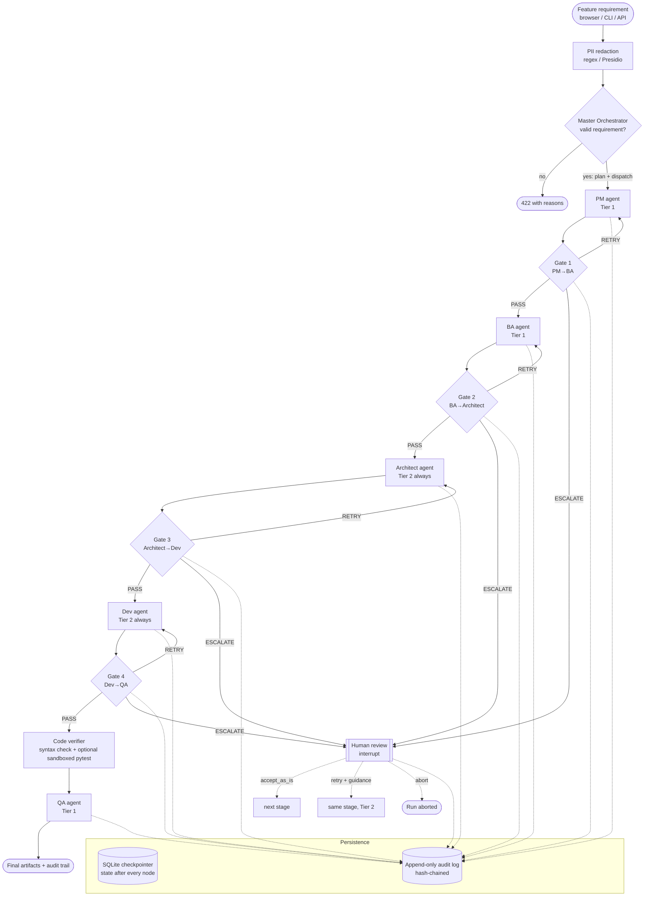
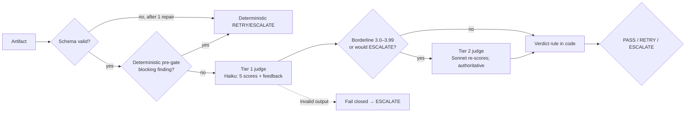

# Architecture

A user's feature requirement enters through the **Master Orchestrator** ([`orchestrator/master.py`](../src/sdlc_loop/orchestrator/master.py)). It redacts PII, validates the requirement (free rule checks, then an LLM triage in live mode), plans the workflow and dispatches it to the pipeline below. The browser UI, its API, and how the orchestrator coordinates the agents are covered in [ui-and-orchestrator.md](ui-and-orchestrator.md).

The pipeline is a **state machine**. It has five fixed stages, four evaluator gates and one human-review interrupt. It is built with LangGraph and checkpointed to SQLite after every node. Every decision a gate makes comes from a written rule in [`graph/routing.py`](../src/sdlc_loop/graph/routing.py). That module is pure-function code with no LLM in it, and the unit tests in [`tests/unit/test_routing.py`](../tests/unit/test_routing.py) cover each rule as a table row.

## 1. Agent loop, data flow and decision points



**Decision points.** There are four evaluator gates (G1–G4), shown as diamonds. Each returns PASS, RETRY or ESCALATE. On ESCALATE the graph pauses at the human-review interrupt, which leads to three possible resume actions. Data moves between stages only as validated Pydantic artifacts: `ProblemBrief → RequirementsPackage → TechnicalDesign → Implementation → TestPlan`.

The diagram shows one human-review node, not four. LangGraph resumes it with whatever handoff is pending, so all four gates share the same node without any change in behaviour.

## 2. Inside one gate

Each gate evaluates in three layers, cheapest first. Code makes the decision; the judge models only produce scores.



| Step | What it does | Cost |
|---|---|---|
| Schema validation | Pydantic validates the structured output. On failure there is one repair call with the validation error appended. | 0 tokens, or 1 repair call |
| Deterministic pre-gate ([`quality/checks.py`](../src/sdlc_loop/quality/checks.py)) | Rejects unambiguous structural defects before any judge runs: a story with no trace link, a risk with no mitigation, generated code that does not parse, a story that is neither implemented nor stubbed. Softer findings are passed to the judge as hints. | 0 tokens |
| Tier 1 judge | Scores the five rubric dimensions from 1 to 5 and writes actionable feedback. | 1 Haiku call |
| Tier 2 confirmation | Runs only when the Tier 1 overall score falls in 3.0–3.99, or when Tier 1's verdict would page a human. | 1 Sonnet call, only when needed |
| Verdict rule | PASS needs mean ≥ 4.0, every dimension ≥ 3 and no critical flag (any dimension scored 1). | 0 tokens |

The gate **fails closed**. If the judge cannot produce valid output, the artifact goes to a human. An unevaluated artifact never passes.

## 3. The retry ladder (reliability engine)

| Attempt | Who runs | Model | Context added |
|---|---|---|---|
| 1 | Persona | Its default tier | Minimal upstream context |
| 2 (retry 1) | Same persona | Same tier (Tier 2 if the retry was caused by a critical flag) | Evaluator feedback and the previous attempt |
| 3 (retry 2) | Same persona | **Tier 2** | Full feedback history and the previous attempt |
| Human | Reviewer via `POST /runs/{id}/resume` or the CLI | — | Artifact, scores, feedback and blocking issues |

On resume, `accept_as_is` continues to the next stage. `retry` needs guidance; it re-runs the stage on Tier 2 with the guidance prepended, and a further failure escalates again. `abort` ends the run.

### Deliberate deviation: the critical-flag fast track

The spec contradicts itself here. Section 5 says a `critical_flag` escalates to a human at *any* attempt. Section 7's anti-pattern check expects a flawed Architect design to trigger a **RETRY**.

The default policy (`SDLC_CRITICAL_POLICY=fast_track`) resolves this:

- A critical flag on a non-final attempt skips the same-tier retry and goes straight to one Tier 2 attempt, with the specific constraint violation as feedback.
- If the critical defect survives that attempt, a Tier 2 judge confirms it and a human is paged.

The reasoning: a contradicted legacy constraint is exactly the kind of defect a stronger model can fix given precise feedback, and reviewer time is the most expensive resource in the loop. `SDLC_CRITICAL_POLICY=strict` gives the spec's verbatim behaviour, and both paths are tested.

## 4. Minimal context passing

| Persona / gate | Receives (never the full run history) |
|---|---|
| PM | The redacted business request, wrapped in `<untrusted_business_request>` |
| BA | The ProblemBrief |
| Architect | The RequirementsPackage and the brief's constraints |
| Dev | The TechnicalDesign, the stories with their acceptance criteria, and the constraints |
| QA | The design, the implementation, the acceptance criteria and the **measured** execution report |
| Judge | The handoff name, the original constraints, the upstream artifact(s), the artifact under review and the pre-gate notes |

The alternative is available for comparison. `SDLC_CONTEXT_POLICY=full_history` sends everything produced so far, including all evaluations. Every call also logs an estimate of the full-history size, so the saving can be measured on every run without running the ablation.

## 5. Module map

```
src/sdlc_loop/
├── orchestrator/        Master Orchestrator (validate → plan → dispatch) + browser view model
├── web/static/          UI: index.html, app.css, app.js (no build step)
├── demo/                demo mode: curated examples, the local simulator, DemoLLMClient
├── runtime.py           startup choice of live (Claude) or demo mode
├── config.py            Settings (env / .env); every cost lever is a switch
├── schemas/             Pydantic v2 contracts: artifacts, rubric/evaluation, human review
├── prompts/             *.md prompt files (spec §6 verbatim) + shared preamble + rubric
├── llm/
│   ├── types.py         LLMClient Protocol, LLMRequest/Response, TokenUsage
│   ├── models.py        model catalog: prices, cache minimums, capabilities
│   ├── model_router.py  persona × attempt → tier (spec §4)
│   ├── cache.py         cache-breakpoint layout (shared prefix first)
│   ├── token_meter.py   cost + counterfactuals (no-cache, all-Tier-2, sync)
│   ├── anthropic_client.py  Claude API: structured outputs, streaming
│   ├── batch_client.py  Message Batches micro-batcher for evals
│   └── fake_client.py   scripted and fault-injecting clients (tests, evals)
├── agents/              one module per persona + evaluator; base = structured call + repair
├── quality/checks.py    deterministic pre-gate
├── tools/code_verifier.py  materialise + syntax-check (+ opt-in sandboxed pytest)
├── graph/               state, stages, routing (pure), nodes, checkpoint, build_graph
├── governance/          audit log (append-only, hash chain), PII redaction, hashing
├── services/            composition root (container) + RunService
├── api/                 FastAPI app + role-based API-key auth
└── cli.py               Typer CLI
evals/                   run_eval, metrics, report, fault_injection, agreement
```

**Dependency direction.** `schemas` ← `llm` ← `agents` ← `graph` ← `services` ← `orchestrator` ← `api` / `cli` / `evals`. Only [`services/container.py`](../src/sdlc_loop/services/container.py) picks concrete implementations. Everything else receives its collaborators through constructors, which is how the tests and the eval harness swap in scripted, fault-injecting or batch LLM backends without touching agent code.

## 6. Other deviations from the spec sketch

| Spec | Built | Why |
|---|---|---|
| `dict` / `list[dict]` fields (`components`, `files`, `traceability`, `dimension_scores`) | Typed sub-models | The Claude structured-outputs API requires `additionalProperties: false` on every object, so free-form dicts cannot be enforced. Typed models also meet the "no raw dicts across modules" standard. |
| `acceptance_criteria: list[str]` | Criteria carry ids (`US-1-AC2`) | QA test cases reference criteria by id, which makes coverage computable (see QA uncovered-criteria metric). |
| QA reports pass/fail | `TestPlan.execution` is attached by code from a real run | The prompt says "never assumed results". Code enforces it: the model cannot write that field. |
| Judge returns an `EvaluationRecord` | Judge returns `JudgeOutput` (scores + feedback); code computes mean, critical flag and verdict | Model arithmetic should never decide a gate. |
| QA output is not gated | Same | The spec defines four handoffs. QA's output is instead checked for acceptance-criterion coverage by metric. |
| Temperature 0 for the judge | Not sent | Anthropic SDK 1.x and current models reject sampling parameters. Judge consistency is **measured** instead, as the verdict-flip rate across repeats in the judge benchmark. |
