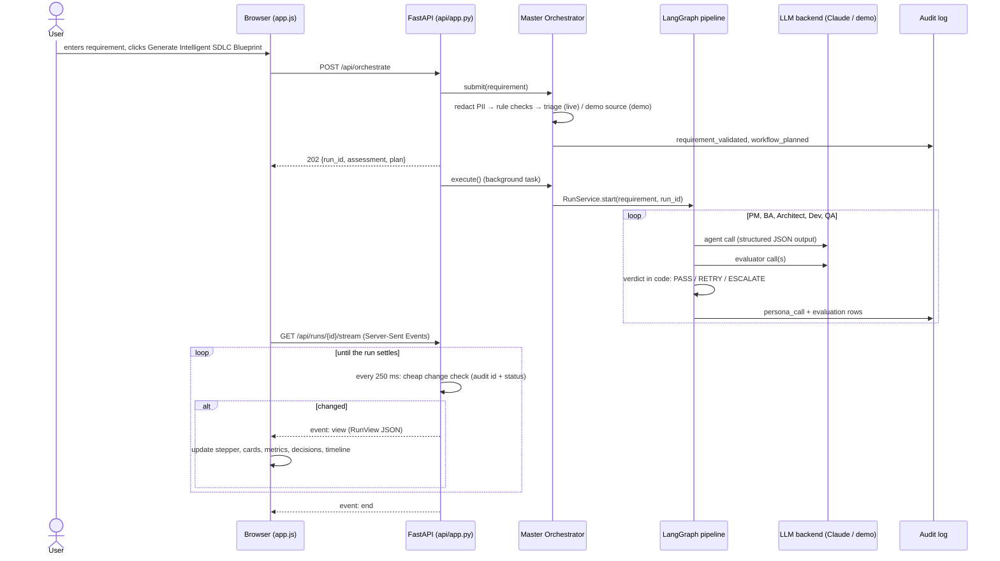

# Web UI, Master Orchestrator and runtime modes

This document explains how a feature requirement travels from the browser, through FastAPI and the Master Orchestrator, to the agents and back to the screen. It also covers how live and demo modes work.

```bash
make start        # live if ANTHROPIC_API_KEY works, otherwise demo → http://127.0.0.1:8000
make ui           # demo mode + open the browser
```

## 1. The user flow

| Step | What happens | Where |
|---|---|---|
| 1 | The user types a **Feature Requirement** and clicks **Generate Intelligent SDLC Blueprint**. | [`web/static/app.js`](../src/sdlc_loop/web/static/app.js) → `submit()` |
| 2 | The browser sends `POST /api/orchestrate {"requirement": "…"}`. | [`api/app.py`](../src/sdlc_loop/api/app.py) → `orchestrate()` |
| 3 | The **Master Orchestrator** redacts PII, validates the requirement, plans the workflow and records both decisions in the audit log. | [`orchestrator/master.py`](../src/sdlc_loop/orchestrator/master.py) → `submit()` |
| 4 | If the requirement is invalid, the API returns **422** with the reasons, shown under the text box. If it is valid, the API returns **202** with the `run_id` and the plan. | same |
| 5 | A background task dispatches the run to the LangGraph pipeline. | `MasterOrchestrator.execute()` → [`services/run_service.py`](../src/sdlc_loop/services/run_service.py) |
| 6 | The agents run in order (PM → BA → Architect → Developer → QA). The Evaluator gates each handoff with PASS, RETRY or ESCALATE, and ESCALATE pauses the run for a human. | [`graph/`](../src/sdlc_loop/graph/) |
| 7 | The browser follows `GET /api/runs/{id}/stream` (Server-Sent Events). The server checks for changes every 250 ms and pushes a `view` event only when an agent, gate or reviewer actually did something, then `end` when the run settles. If streaming is unavailable, the browser polls `GET /api/runs/{id}/view?since=<version>` instead, which answers **204** while nothing has changed. | `follow()` / `poll()` in `app.js`; [`orchestrator/view.py`](../src/sdlc_loop/orchestrator/view.py) |

## 2. How the components connect



**Frontend ↔ backend contract.** There is one origin, so no CORS. FastAPI serves the page at `/` and the assets at `/static/*`. The UI calls the following endpoints:

| Call | When | Used for |
|---|---|---|
| `GET /api/config` | Page load | The UI builds itself from this: mode and the reason for it, agent names and descriptions, gate labels, rubric dimension labels, models, pass rule, examples. Nothing about the pipeline is hardcoded in JavaScript. |
| `POST /api/orchestrate` | Submit | 202 → start polling; 422 → show the reasons |
| `GET /api/runs/{id}/stream` | While a run is active | Live updates: one `view` event per change |
| `GET /api/runs/{id}/view?since=v` | Fallback when streaming is unavailable | Same view; 204 when unchanged |
| `POST /runs/{id}/resume` | Review panel buttons | Accept, retry with guidance, abort |
| `GET /api/runs/{id}/report.pdf` | **Download SDLC Execution Report (PDF)** | The run rendered as a formatted PDF by [`reports/pdf.py`](../src/sdlc_loop/reports/pdf.py), from the same view as the dashboard |
| `GET /api/runs` | Run History | Past runs (`?run=<id>` reopens one) |

## 3. How the Master Orchestrator manages the workflow

The orchestrator is the single entry point between a requirement and the agents. It does four things, in order:

1. **Validate.** Checks run cheapest first, so an invalid request never pays for a pipeline run:
   - **Rule checks** (0 tokens): not empty, 12–4,000 characters, at least 3 words.
   - **Live mode:** a Haiku triage call asks "is this a software requirement?". It rejects questions, small talk and pure prompt-injection text before any agent runs.
   - **Demo mode:** it picks the source of the outputs. A requirement that matches a curated example replays that example; **any other requirement goes to the simulator**.
2. **Plan.** It lists, per step, the agent, its model tier, what the agent receives and produces, and which evaluator gate follows.
3. **Dispatch.** It hands the redacted requirement to the LangGraph state machine.
4. **Record.** Validation, rejection and planning go into the audit log, the same source the browser view and the metrics read from.

**How it communicates with the agents.** It does so through the state machine, never directly:

- Each agent is a graph node that reads only the upstream artifact it needs from shared state and writes back its own validated artifact.
- After each node, an evaluator gate node scores the artifact.
- Code in [`graph/routing.py`](../src/sdlc_loop/graph/routing.py) turns the scores into the verdict. Conditional edges then route the run:
  - **PASS** goes to the next agent.
  - **RETRY** returns to the same agent with the feedback; the last attempt runs on the stronger model.
  - **ESCALATE** pauses the graph with `interrupt()` until a reviewer decides.

The orchestrator deliberately does not use an LLM to choose the next agent. That would add cost and variance to the part of the system that must be predictable.

## 4. Live mode and demo mode

[`runtime.py`](../src/sdlc_loop/runtime.py) chooses the mode once, at startup:

| `SDLC_MODE` | Credentials found and verified | Credentials missing | Credentials rejected |
|---|---|---|---|
| `auto` (default) | **live** | demo ("No Anthropic credentials were found") | demo, with the reason ("…was rejected (401)") |
| `live` | **live** | startup fails with instructions | startup fails with the reason |
| `demo` | demo (the key is never used) | demo | demo |

"Verified" means one free `models.retrieve` call succeeds. `.env` is loaded into the process at startup; before this release it was never loaded, so a key placed only in `.env` did not reach the Anthropic SDK.

**What differs between the modes.** Only the LLM backend. In live mode it is the Anthropic client. In demo mode it is `DemoLLMClient`, which sends each run to one of two sources:

- **A curated example** ([`demo/library.py`](../src/sdlc_loop/demo/library.py)): hand-authored outputs in the exact shape of model output, written to show specific evaluator behaviour. "Build a Leave Management System" shows a borderline BA score confirmed by the Tier-2 judge, then a retry. Golden scenario 1 shows a critical legacy-constraint violation, then a Tier-2 retry.
- **The simulator** ([`demo/simulator.py`](../src/sdlc_loop/demo/simulator.py)), used for every other requirement:
  - The agents fill schema-valid templates from the requirement text.
  - The judge is rule-based and scores the actual artifact under review, for example "Expected 3-5 measurable business goals, found 2".
  - The first PM draft is deliberately thin, so every simulated run shows the evaluator rejecting the PM output and the retry fixing it.
  - The generated code is real Python whose own tests pass (3/3) when executed.

Everything else is identical in both modes: the orchestrator, the gates, the retry and escalation rules, human review, the code verifier and the audit log.

**Labelling.** The UI never presents simulated or curated output as Claude output. Each run carries a source badge (*Claude (live)*, *Curated example*, *Simulated (no model)*), simulated calls report the model `local-simulator` at $0, and the workflow plan notes that the listed Claude models are live-mode routing, not what produced the run.

## 5. How the output is rendered

`GET /api/runs/{id}/view` returns a display-ready `RunView` built from two sources:

- **The audit log:** every attempt of every agent, including rejected ones; all scores, decisions and timing; tokens and cost.
- **The checkpoint state:** the current status and any pending human-review request.

| Section | Shows |
|---|---|
| Master Orchestrator | Validation checks, workflow plan, source badge, status, live "running for / finished in" clock |
| Agent cards (6) | Status badge (Pending, Running, Retrying, Needs review, Passed, Completed), log of attempts and gate verdicts, elapsed time on the running stage |
| Human review | Only when escalated: feedback, blocking issues, Accept / Retry-with-guidance / Abort |
| Final Result | Headline, gates passed, retries, escalations, calls, tokens, cost, deliverables, measured test result, error (if failed), **Download SDLC Execution Report (PDF)** |
| **Decisions** | Every routing decision: time, gate, attempt, PASS / RETRY / ESCALATE or the human action, who decided it and why |
| Agent Outputs | One tab per agent (←/→ keys), one pill per attempt, the artifact rendered as readable sections next to the evaluator's score bars and feedback |
| Evaluation Scores | Every gate and attempt: 5 dimensions, overall score, judge tier, verdict |
| Execution Timeline | Every audit event, in order |

**Rendering rules.**

- The DOM is built with `textContent` only; `innerHTML` is never used, and a test enforces this. Model output is untrusted.
- Under the Content-Security-Policy, bar widths are set through the CSSOM, never inline style attributes.
- UI state survives updates: the selected tab and attempt, expanded code files, and guidance a reviewer is typing.

## 6. Bugs found and fixed in this review

| Bug | Cause | Fix |
|---|---|---|
| A healthy run could briefly show **Failed**, and the browser then stopped updating | Between graph steps LangGraph can expose a checkpoint with no pending node, and the status code read that as "stopped mid-way" | Failure is now reported only from a `run_failed` audit row, or for a stopped run that nothing is executing. Regression tests poll a live run and assert "failed" never appears. |
| The review panel could fail to appear after an escalation | The gate marks the run *blocked* one step before the graph actually pauses; the browser stopped polling in that gap | Status stays *running* until the review request exists, and the poll's change token includes the pending-review flag |
| Expanded code files collapsed and log scroll reset every second | Every poll re-rendered the whole page | Re-render only when the server's version changes (204 otherwise); preserve open files and selections |
| New requirements were refused in demo mode ("needs live mode") | Demo mode could only replay fixtures | The simulator runs any requirement through the full workflow |
| A key in `.env` did not enable live mode | `.env` was never exported to the process | `load_environment()` at startup; real environment variables still take precedence |
| Model ids shown as `claude-haiku-4-<PHONE_1>` | PII phone pattern matched digits inside hyphenated ids | Pattern ignores hyphen-joined digits; regression test |
| Sidebar showed an API-key field with auth off | CSS `display` overrode the `hidden` attribute | Global `[hidden] { display: none !important }` |
| Page overflowed horizontally on narrow screens | `1fr` grid track grew to the widest table | `minmax(0, 1fr)`; long tokens wrap |
| Unreadable yellow notice | Light text inherited onto a light background in dark mode | Every colour is an explicit pair per theme; the banner is white on deep blue (10.4:1) in both themes |

## 7. Screens


**1. Feature Requirement.** Dark theme by default, in Times New Roman. The compact status bar at the top shows the mode (orange dot: demo with the local simulator and no API cost; green dot: live, Claude connected) and why that mode was chosen. The chips fill in curated examples; any other text also works.


**2. Workflow Progress and agents.** This is a simulated run of "Evaluator Rejects PM Output (Retry Logic)".

- **Stepper:** runs from the Orchestrator to the Final Report and updates live over the stream. Blue is running (with a spinner), gray waiting, orange retry, red needs review or failed, green done.
- **Activity line:** says what is happening right now, e.g. "Business Analyst is working · attempt 1 · 3s".
- **Product Manager card:** shows the rejected first draft (**RETRY 3.80**, confirmed by the Tier-2 judge) and the passing retry (**4.60**).


**3. Final Result and Run Metrics.** The final result reports 4/4 gates passed, 1 retry and $0 cost. The metrics are computed from this run's audit trail:

- first-pass success and retry rate;
- average stage time;
- model latency and cache hit rate, shown as "—" with the reason when no model was called;
- token usage per agent as horizontal bars.


**4. Product Guide.** In-app documentation: how it works, agent responsibilities (built from `/api/config`), the Master Orchestrator, LLM integration and mode switching, the evaluation rubric with a worked retry example, an annotated dashboard tour, cost levers, governance, run commands and troubleshooting.
